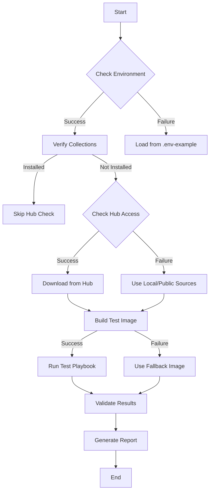

# ADR 0001: Bootstrap E2E Testing Flow

## Status

Proposed

## Context

The `bootstrap_e2e.sh` script is encountering several issues during execution:
1. Timeouts when connecting to Red Hat Automation Hub
2. Collection dependency verification challenges
3. Environment setup complexities
4. Token authentication problems

We need a more robust and predictable testing flow that can handle these issues gracefully.

## Decision

We will implement a staged testing approach with clear fallback mechanisms:



### Testing Stages

1. **Environment Check**
   - Validate required environment variables
   - Check tool dependencies
   - Fallback: Use .env-example with minimal settings

2. **Collection Verification**
   - Check if required collections are installed
   - Skip Hub authentication if collections exist
   - Fallback: Use public Galaxy if Hub unavailable

3. **Image Building**
   - Build test image with timeout protection
   - Fallback: Use pre-built image if build fails
   - Implement retry mechanism with exponential backoff

4. **Test Execution**
   - Run tests with proper timeout settings
   - Capture all output streams
   - Enable debug mode when needed

### Implementation Rules

1. **Timeouts**
   ```bash
   # Example timeout implementation
   execute_with_timeout() {
       local timeout=$1
       local cmd=$2
       local fallback=$3
       
       if timeout "$timeout" "$cmd"; then
           return 0
       else
           log_warn "Command timed out, trying fallback"
           eval "$fallback"
       fi
   }
   ```

2. **Collection Management**
   ```bash
   # Example collection check
   check_collections() {
       local required_collections=(
           "amazon.aws"
           "community.general"
           "ansible.posix"
       )
       
       for collection in "${required_collections[@]}"; do
           if ! ansible-galaxy collection list | grep -q "$collection"; then
               return 1
           fi
       done
       return 0
   }
   ```

3. **Error Handling**
   ```bash
   # Example error handling
   handle_stage_error() {
       local stage=$1
       local error=$2
       local retry_count=${3:-0}
       
       log_error "Error in stage $stage: $error"
       if [[ $retry_count -lt 3 ]]; then
           log_info "Retrying stage $stage (attempt $((retry_count + 1)))"
           return 0
       fi
       return 1
   }
   ```

## Consequences

### Positive

- More predictable testing flow
- Clear fallback mechanisms
- Better error handling and reporting
- Reduced dependency on external services
- Faster execution when collections are present

### Negative

- More complex implementation
- Additional maintenance overhead
- Need to maintain fallback mechanisms
- Potential divergence between Hub and local testing

## Implementation Plan

1. **Phase 1: Basic Flow**
   - Implement basic staged approach
   - Add timeout protection
   - Add collection verification

2. **Phase 2: Fallbacks**
   - Implement fallback mechanisms
   - Add retry logic
   - Create fallback image handling

3. **Phase 3: Reporting**
   - Add detailed logging
   - Implement result aggregation
   - Create test reports

## Validation

Success criteria for this implementation:

1. Script completes within 5 minutes
2. Handles Hub connectivity issues gracefully
3. Provides clear error messages
4. Generates detailed test reports
5. Maintains compatibility with existing CI/CD pipelines

## References

- [Ansible Collection Structure](https://docs.ansible.com/ansible/latest/dev_guide/developing_collections.html)
- [Ansible Testing Strategies](https://docs.ansible.com/ansible/latest/dev_guide/testing.html)
- [Red Hat Automation Hub API](https://console.redhat.com/ansible/automation-hub/) 