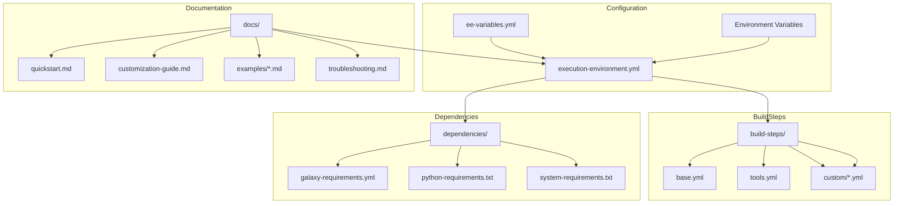

# [ADR-0007] Making Execution Environment Reusable and Customizable

## Status

Proposed

## Context

The current execution environment configuration (`execution-environment.yml`) contains hardcoded values and tightly coupled components that make it difficult for end users to fork and customize for their own projects. We need to make this configuration more modular, customizable, and well-documented to enable easier reuse across different projects and teams.

Key challenges include:
- Hardcoded base image and repository references
- Monolithic build steps that combine multiple tool installations
- Limited documentation on customization options
- Lack of templates and examples for common use cases
- Complex dependency management across multiple files

## Decision

We will restructure the execution environment configuration using the following approach:

1. **Variable Externalization**
   - Create `ee-variables.yml` for customizable configuration
   - Support environment variable overrides for CI/CD flexibility
   - Document all available configuration options

2. **Modular Build Steps**
   - Split `additional_build_steps` into purpose-specific modules
   - Create a plugin-like system for optional tool installations
   - Provide clear interfaces for extending build steps

3. **Dependency Management**
   - Template-based dependency files with documented options
   - Version pinning recommendations
   - Clear separation of mandatory vs optional dependencies

4. **Documentation Structure**
   - Comprehensive README with quick start guide
   - Step-by-step customization tutorials
   - Common use case examples
   - Troubleshooting guide

5. **Base Image Flexibility**
   - Support for multiple base image options
   - Clear documentation of image requirements
   - Authentication handling guidelines

## Consequences

### Positive
- Users can more easily customize the execution environment
- Reduced maintenance burden through modularity
- Better separation of concerns
- Clearer upgrade paths
- More flexible CI/CD integration

### Negative
- Initial complexity in setting up the modular structure
- More files to maintain
- Need to maintain backward compatibility
- Additional documentation overhead

## Alternatives Considered

1. **Configuration Generator**
   - Create a tool to generate execution environment configs
   - Rejected due to added complexity and maintenance burden

2. **Multiple Pre-built Variants**
   - Provide several pre-configured variants
   - Rejected as it wouldn't solve the core customization needs

3. **Single Monolithic Template**
   - Keep single file with all options commented
   - Rejected as it would be harder to maintain and understand

## References

- [Ansible Builder Documentation](https://ansible-builder.readthedocs.io/)
- [Execution Environment Best Practices](https://www.ansible.com/blog/execution-environment-best-practices)
- [Container Build Best Practices](https://docs.docker.com/develop/develop-images/dockerfile_best-practices/)

## Architecture Diagram

## Notes

Implementation phases:
1. Create variable template and documentation
2. Modularize build steps
3. Update dependency management
4. Create examples and tutorials
5. Update CI/CD to validate customization options 